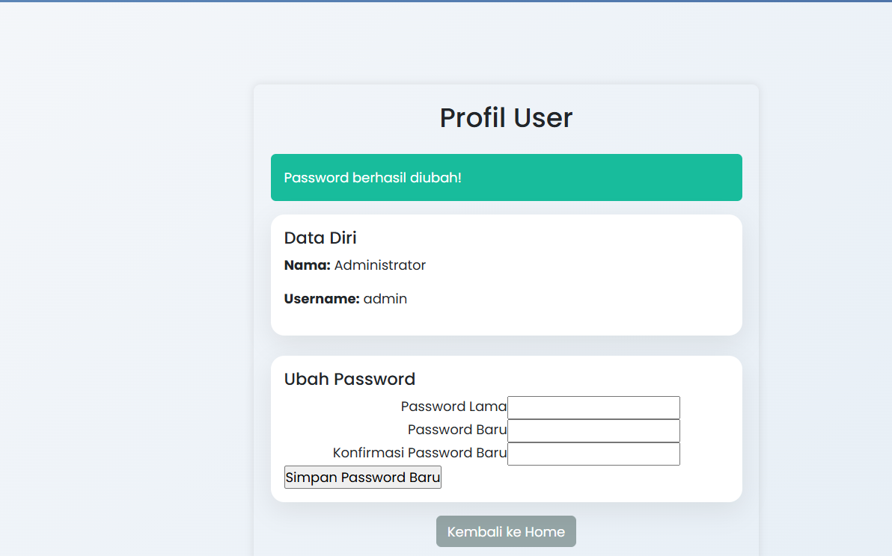
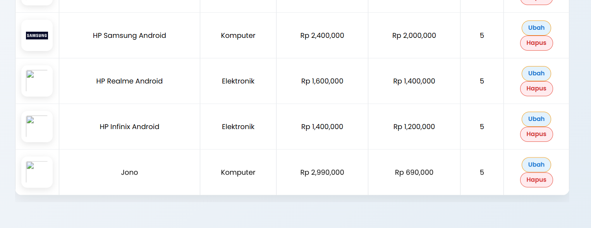
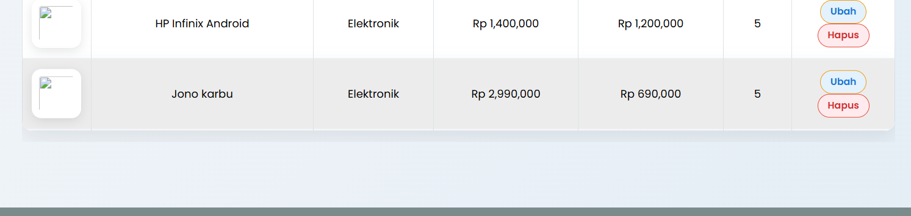
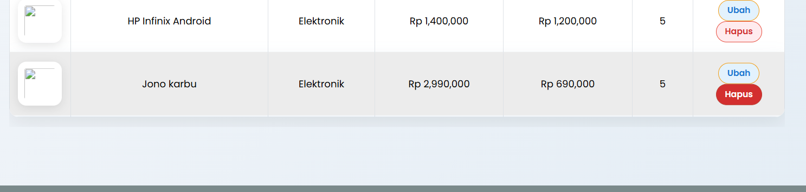
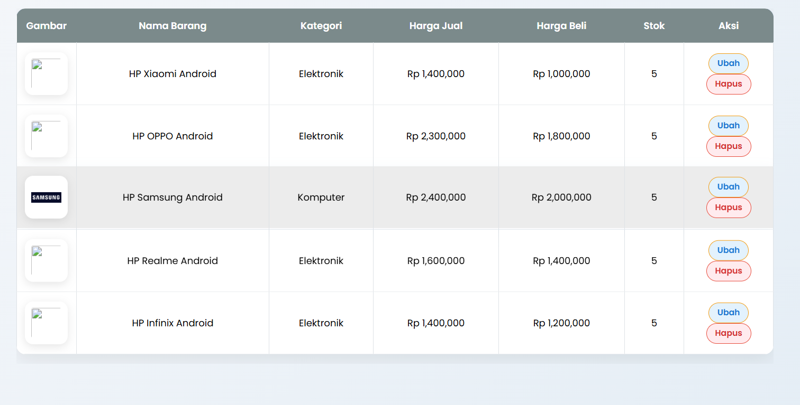

# Latihan Pagination dan Search bar


Halo halo, Sekarang disini akan mencoba implement pagination untuk data barang dan search bar.
Cek juga repo lain nya:
 [Html dasar](https://github.com/laLafid/Lab1Web), [CSS dasar](https://github.com/laLafid/lab2web), [CSS](https://github.com/laLafid/Lab3Web), [CSS Layout](https://github.com/laLafid/Lab4Web), [Dasar Javascript](https://github.com/laLafid/Lab5Web), [Dasar Bootstarp](https://github.com/laLafid/Lab6Web), [Dasar PHP](https://github.com/laLafid/Lab7Web), [CRUD PHP](https://github.com/laLafid/Lab8Web),  [Modular PHP](https://github.com/laLafid/Lab9Web), [OOP PHP](https://github.com/laLafid/Lab10Web), [OOP Lanjutan](https://github.com/laLafid/Lab11Web) dan [Autentikasi Tahap Lanjut](https://github.com/laLafid/Lab12Web) .


## Langkah-langkah

1. **Persiapan**
    - Editornya, misal Visual Studio Code.
    
    
    - XAMPP, kalo belum punya unduh dulu di [sini](https://www.apachefriends.org/).

    - Buka XAMPP control panel dulu, aktifin ``apache`` dan ``mysql`` lalu pencet admin dibagian ``mysql`` buat masuk ke phpmyadmin.
    

    - Pake Database sebelumnya, kalo belum punya cek [CRUD PHP](https://github.com/laLafid/Lab8Web)

    - Koneksi Database pake PHP

    
    
    liat ``config.php``

    - jangan lupa ya path file nya..

    


2. **Penerapan**

    - Untuk dapat page, tambahin di function getAll yang ada di ``db.php``
    ```php
    public function getAll($table, $where = null) {
        if ($where) $where = " WHERE " . $where;

        $sql = "SELECT * FROM " . $table . $where;
        $sql_count = "SELECT COUNT(*) FROM " . $table . $where; //
        if(isset($sql_where)) {
            $sql .= " " . $sql_where;
            $sql_count .= " " . $sql_where;
        }
        $result_count = $this->query($sql_count);
        $count=0;
        if($result_count){
            $row_count = $result_count->fetch_row();
            $count = $row_count[0];
        }
        $per_page = 10;
        $num_page = ceil($count / $per_page);
        $limit = $per_page;

        if (isset($_GET['page'])) {
            $page = (int)$_GET['page'];
            $start = ($page - 1) * $per_page;
        } else {
            $start = 0;
        }
        $sql .= " LIMIT " . $start . "," . $limit;
        $result = $this->query($sql);
        return [   //bagian ini dipakai untuk tahap selanjutnya
            'data' => $result,  
            'num_page' => $num_page
        ];
    }
    ```


    - Tapi sebelum itu, bikin dulu untuk search ny
        - di ``home.php``
        ```php
        $q = ''; // untukny pencarian
        if (isset($_GET['submit']) && !empty($_GET['q'])) {
            $q = $_GET['q'];
            $sql_where = "nama LIKE '{$q}%'"; 
        } else{ $sql_where=null;}
        ```
        
        - dan ini untuk bar ny, sebelum bentuk tabel
        ```html
        <form action="" method="GET" class="mb-4">
            <input type="text" name="q" value="<?= htmlspecialchars($q) ?>" placeholder="Cari nama barang...">
            <button type="submit" name="submit" class="btn btn-primary">Cari</button>
        </form>
        ```


    - Terakhir
        - bagian atas ``home.php`` sama seperti tadi untuk search.
        ```php
        $b = $db->getAll('data_barang', $sql_where);
        $barang = $b['data']; // nah ini
        $num_page = $b['num_page']; 
        ```

        - setelah tabel
        ```php
        <ul class="pagination">
        <?php 
        $page = isset($_GET['page']) ? (int)$_GET['page'] : 1;
        $que = !empty($q) ? "&q=$q&submit=1" : "";

        if ($page > 1) {
            $prev = $page - 1;
            $prev_link = "?page={$prev}" . (!empty($q) ? "&q={$q}" : "");
            echo "<li><a href='{$prev_link}'>&laquo; </a></li>";
        } else {
            echo "<li class='disabled'><a>&laquo; </a></li>";
        }
        

        for ($i=1; $i <= $num_page; $i++) { 
            $link = "?page={$i}" . (!empty($q) ? "&q={$q}" : "");  // make q untuk tahu batas nya 
            if ($i == $page) {
                echo "<li class='active'><a href='{$link}'>{$i}</a></li>";
            } else {
                echo "<li><a href='{$link}'>{$i}</a></li>";
            }
        }
        
        if ($page < $num_page) {
            $next = $page + 1;
            $next_link = "?page={$next}" . (!empty($q) ? "&q={$q}" : "");
            echo "<li><a href='{$next_link}'> &raquo;</a></li>";
        } else {
            echo "<li class='disabled'><a> &raquo;</a></li>";
        }
        ?>
        </ul>
        ```

    - Terakhir2️⃣ , nambahin data ke data_barang


3. **Hasil Akhir**
    
    - Demo
    

    - Profile
    

    - Tambah Barang
    
    

    - Edit Barang
    
    

    - Delete Barang
    
    

    
## Akhir Kata


*Selamat mencoba*
